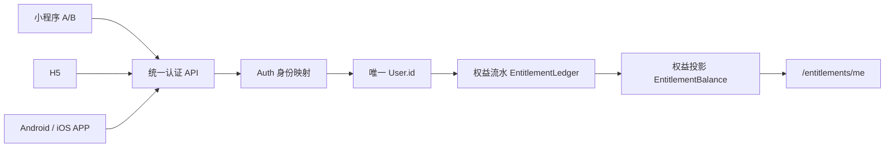

# 热卜统一账号与权益中心实施手册

## 目标与结论

所有小程序、H5、Android/iOS APP 共用一个后端 `User.id`。终端登录成功后只拿平台 JWT，不在客户端维护独立会员状态；所有权益统一由 `GET /api/v1/entitlements/me` 返回。

旧用户不创建新账号、不迁移 `User.id`，原有订单、会员、余额、优惠券和内容购买记录全部保留。旧微信身份会在首次成功登录时原位升级；手机号/密码用户继续使用原账号登录，需要使用微信免登时在原账号内绑定一次微信即可。



## 身份模型

`Auth` 一行表示一个外部身份，不再限制“一个用户每种 provider 只能一行”。身份唯一键是：

`provider + namespace + subject`

约定如下：

| provider | namespace 示例 | subject | 说明 |
| --- | --- | --- | --- |
| `PASSWORD` | `password` | 手机号 HMAC 或历史 `userId` | 密码凭证 |
| `PHONE` | `phone` | 手机号 HMAC | 短信登录身份 |
| `WECHAT` | `wechat:miniprogram:wx...` | OpenID | 某个具体小程序/公众号/APP 的渠道身份 |
| `WECHAT_UNION` | `wechat-open:rebu` | UnionID | 同一微信开放平台下跨应用的唯一锚点 |

同一开放平台内，各微信应用的 `openPlatformId` 必须完全相同。OpenID 只能在单个 AppID 内识别用户，不能跨应用直接比较。

系统遇到 OpenID 和 UnionID 分别归属不同 `User.id` 时返回 `AUTH_IDENTITY_CONFLICT`，不会自动合并资产。此策略用于避免把订单、余额和实名信息错误转给另一账号。

## 服务端配置

推荐只使用 `WECHAT_LOGIN_CLIENTS_JSON` 管理多应用。`clientKey` 是可以下发到客户端的公开选择器，`appSecret` 只能保存在服务端。

```dotenv
WECHAT_OPEN_PLATFORM_ID=rebu
WECHAT_LOGIN_CLIENTS_JSON={"rebu-mini":{"type":"miniprogram","appId":"wx_mini_a","appSecret":"服务端密钥","openPlatformId":"rebu","isDefault":true},"rebu-mini-b":{"type":"miniprogram","appId":"wx_mini_b","appSecret":"服务端密钥","openPlatformId":"rebu"},"rebu-h5":{"type":"h5","appId":"wx_official","appSecret":"服务端密钥","openPlatformId":"rebu","isDefault":true},"rebu-app":{"type":"app","appId":"wx_open_app","appSecret":"服务端密钥","openPlatformId":"rebu","isDefault":true}}
```

每个客户端构建配置公开的 `VITE_WECHAT_CLIENT_KEY`。微信小程序未显式配置时会自动上送运行时 AppID；同类型只配置一个应用时可使用默认项，多应用且未指定客户端时服务端会拒绝猜测。

所有微信小程序、公众号和移动应用必须先在微信开放平台完成绑定，否则微信不会提供可跨端关联的同一 UnionID。

## 权益模型

- `EntitlementLedger`：不可变流水，记录发放、消费、冲正、调整和迁移；`idempotencyKey` 全局唯一。
- `EntitlementBalance`：按用户、权益键、资源和作用域聚合的当前状态；`version` 用于多端并发原子扣减。
- 支付订单变为 `PAID` 与权益发放处于同一个数据库事务。
- 退款成功与原订单权益冲正处于同一个数据库事务，只撤销该订单发放的权益。
- 查询接口同时投影尚未回填的旧会员、已支付数字订单、电子书、学院内容、国学币和优惠券，迁移期间不会出现权益空窗。

当前标准权益键包括：

| 权益键 | 含义 |
| --- | --- |
| `membership.school` | 书院会员 |
| `membership.practitioner` | 从业者专业会员 |
| `course.access` / `bundle.access` | 课程或合集访问 |
| `bot_service.access` / `paipan.access` / `livestream.access` | 数字服务访问 |
| `ebook.access` | 电子书访问 |
| `institute-content.access` | 学院内容访问 |

## API

- `POST /api/v1/auth/login/wechat`：请求包含 `code`、`loginType`（`miniprogram|h5|app`）和 `clientKey`。
- `POST /api/v1/auth/login/mini-phone`：小程序微信身份和手机号身份一次完成解析/绑定。
- `POST /api/v1/auth/bind/wechat`：已登录旧用户绑定具体微信端，不重新注册。
- `GET /api/v1/entitlements/me`：当前用户全部有效/失效权益及钱包摘要。
- `GET /api/v1/entitlements/me/ledger`：当前用户权益流水。
- `POST /api/v1/entitlements/admin/grant`：超级管理员幂等发放。
- `POST /api/v1/entitlements/admin/revoke-source`：超级管理员按来源冲正。

客户端统一使用 `apps/mobile/src/lib/entitlement-data.ts`，禁止以当前小程序 AppID、本地缓存或某一订单表作为权益归属条件。

## 上线顺序

1. 备份生产数据库并确认可恢复；核验全部微信应用已绑定同一开放平台。
2. 配置 `WECHAT_OPEN_PLATFORM_ID` 和 `WECHAT_LOGIN_CLIENTS_JSON`，不要把密钥放入 `VITE_*`。
   - 只有确认归属同一微信开放平台帐号的应用才填同一编号；未配置时系统会按 AppID 隔离，不会冒险自动合并账号。
3. 执行 `pnpm --filter @guoxue/server exec prisma migrate deploy`。
4. 部署新版服务端，先验证手机号/密码登录和一个存量微信用户。
5. 只读审计：`pnpm migration:backfill-unified-accounts`。
6. 如果报告 UnionID 冲突，停止回填并人工确认账号归属；禁止直接改成任一用户。
7. 审计通过后执行：`pnpm migration:backfill-unified-accounts -- --apply`。脚本具备幂等键，可安全重跑。
8. 发布各小程序、H5 和 APP；逐端完成登录、权益查询、下单、退款验收。

迁移是加法式变更，旧业务表保留。数据库迁移后不要回滚到仍假设 `Auth(userId, provider)` 唯一的旧服务端版本；发生客户端问题时可只回滚客户端，服务端采用向前修复。

## 验收矩阵

至少选择一个存量会员用户和一个普通用户，记录同一 `User.id` 后执行：

| 场景 | 期望 |
| --- | --- |
| 手机号分别登录小程序、H5、APP | 三端 `auth/me.id` 一致，权益清单一致 |
| 同一开放平台微信登录小程序 A/B、APP、H5 | 首次绑定后均解析为同一 `User.id` |
| 老微信账号首次登录新版 | 不新增 `User`，旧 `Auth` 原位升级 |
| 会员购买支付成功 | 订单和 `membership.school` 同时可见 |
| 数字内容购买成功 | 任意端立即出现对应 `.access` 权益 |
| 同一支付回调重复到达 | 只产生一条发放流水，余额不重复增加 |
| 已支付订单退款 | 只冲正该订单权益，其他购买不受影响 |
| 两端同时消费最后一份额度 | 仅一个请求成功，余额不会为负 |
| OpenID/UnionID 归属冲突 | 登录被拒绝并保留原资产，不静默合并 |

## 运行检查

```sql
-- 不应存在同一微信开放平台锚点归属多个用户的情况
SELECT "namespace", subject, COUNT(DISTINCT "userId")
FROM "Auth"
WHERE provider = 'WECHAT_UNION'
GROUP BY "namespace", subject
HAVING COUNT(DISTINCT "userId") > 1;

-- 不应有负数的有限权益余额
SELECT id, "userId", "entitlementKey", quantity
FROM "EntitlementBalance"
WHERE unlimited = false AND quantity < 0;

-- 核对已退款订单仍存在的活动权益（正常应为空）
SELECT el."sourceId", el."userId", el."entitlementKey"
FROM "EntitlementLedger" el
JOIN "Order" o ON o.id = el."sourceId"
WHERE el."sourceType" = 'ORDER' AND o.status = 'REFUNDED' AND el.action IN ('GRANT', 'MIGRATE')
  AND NOT EXISTS (
    SELECT 1 FROM "EntitlementLedger" rev
    WHERE rev.action = 'REVOKE' AND rev."reversesLedgerId" = el.id
  );
```

生产监控重点关注 `AUTH_IDENTITY_CONFLICT`、微信 code 换取失败、权益幂等键冲突、退款本地记账补偿告警，以及 `/entitlements/me` 的错误率和 P95 延迟。
